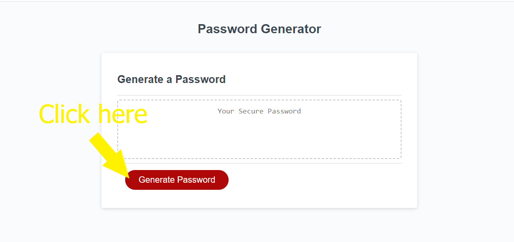
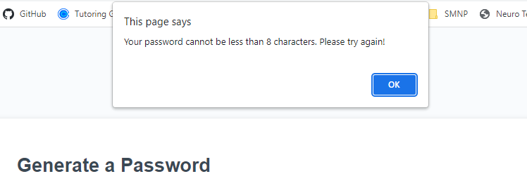
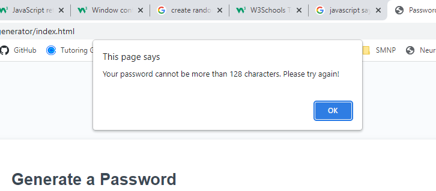
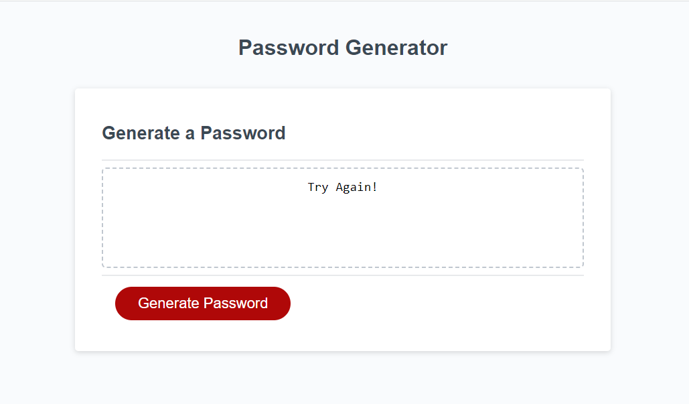
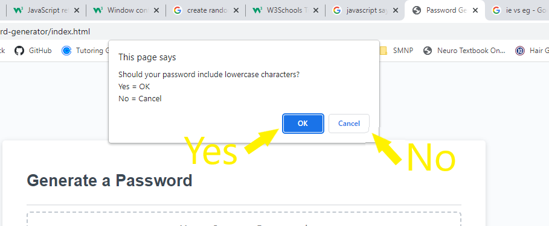
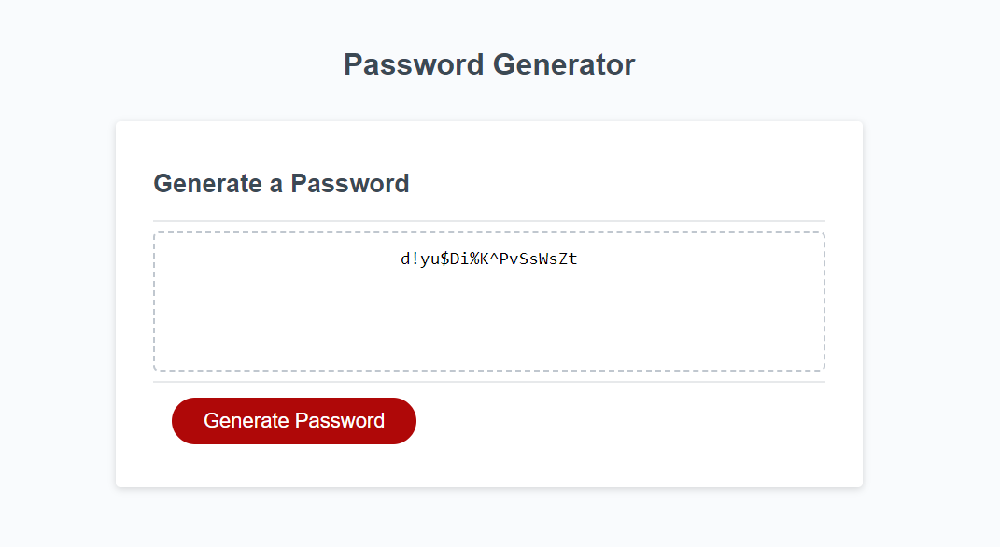
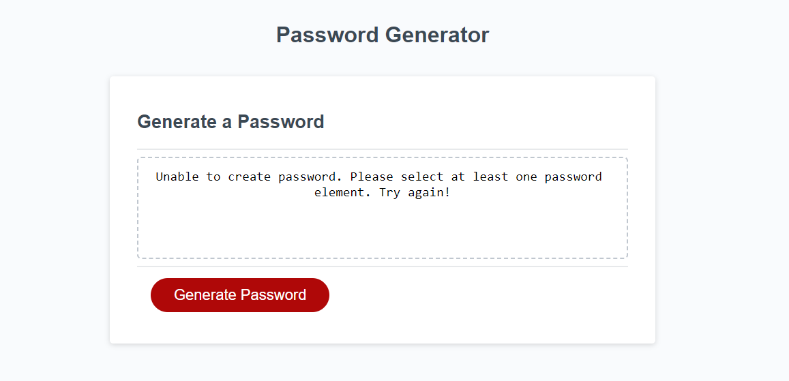

# <Password-Generator>

## Description

This is a website desgined to create a unique radomized password for a user based on certain criteria the user can select. The user is allowed to choose the number of characters in the password (anywhere between 8 and 128), and if it should include lowercase letter, capital letters, numbers, or special characters e.g. %. 

## Usage

To begin, click the red "Generate Password" button

You will be prompted to enter a number from 8 to 128. Any number smaller than 8 or larger than 128 will result in an error, and the user will be taken back to the prompt to select an appropriate number. If the user cancels at this point, they are prompted to try again and restart the process. 

Once the user selects an appropriate number, then they are prompted to choose if the password will include lowercase letters, capital letters, numbers, or special characters, with the "OK" button resulting in yes and the "cancel" button resulting in no.

Once the user selects all of their desired values, a randomized password will appear in the box above the "Generate Password" button and replace the words "Your Secure Password".

If the user selected no/"cancel" for all four password criteria, a message will appear, telling the user a password could not be generated and to try again.

The user may generate another password, if desired, but will have to go through the criteria selection prompts again.

## Resources

<li><a href="https://www.w3schools.com/js/js_popup.asp">Window Pop-up/Confirm</li>

<li><a href = "https://www.w3schools.com/jsref/met_win_prompt.asp">Window Prompt</li>

<li><a href = "https://www.w3schools.com/jsref/jsref_return.asp">Return Method</li>

<li><a href = "https://www.youtube.com/watch?v=jww3V2fSQyg">How to Create a Random String</li>